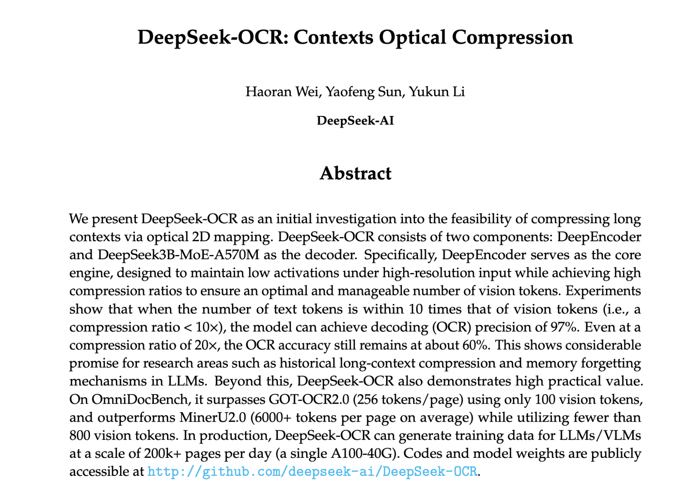
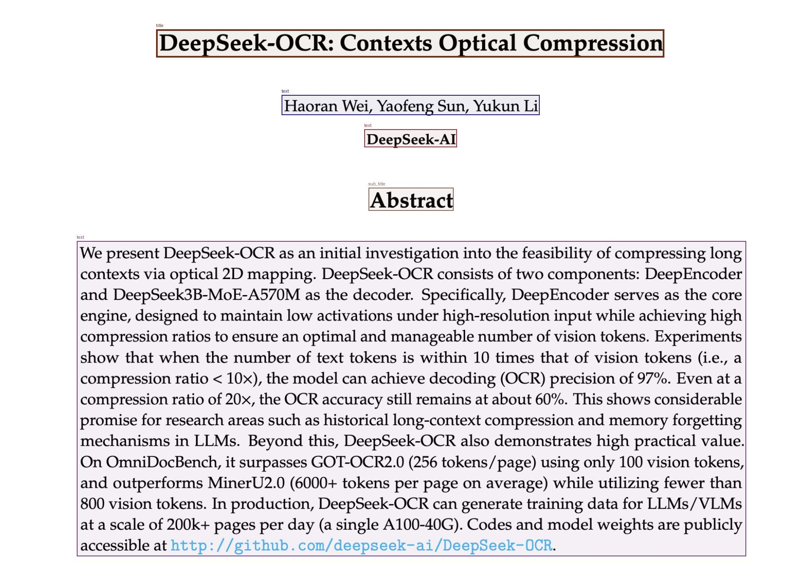

# DeepSeek-OCR: Contexts Optical Compression on A100

Hands-on tutorial for using the DeepSeek-OCR model from the [DeepSeek-OCR paper](https://github.com/deepseek-ai/DeepSeek-OCR/blob/main/DeepSeek_OCR_paper.pdf). This notebook demonstrates how to compress document images to ~100 vision tokens (10-20x fewer than text) and decode with 97% OCR precision at 10x compression ratio.

## Overview

DeepSeek-OCR uses a novel architecture combining:
- **DeepEncoder**: SAM + CLIP + 16x compressor (380M params)
- **3B MoE Decoder**: DeepSeek3B-MoE with 570M active params

### Key Features

- **High Compression**: 10x compression with 97% OCR precision, up to 20x with 60% accuracy
- **Flash Attention**: Optimized for A100 GPUs (~1-2s per page)
- **Multi-Resolution Modes**: From Tiny to Gundam for high-res PDFs
- **Batch Processing**: Scales to 200k pages/day with vLLM
- **Superior Performance**: Beats GOT-OCR2.0 on OmniDocBench with fewer tokens
- **Structured Output**: Preserves tables, headers, and document layout in Markdown

## Requirements

- Python 3.12
- NVIDIA A100 GPU (40GB recommended)
- CUDA 11.8
- ~10GB disk space

### Dependencies

```bash
torch==2.6.0
torchvision==0.21.0
torchaudio==2.6.0
transformers==4.46.3
tokenizers==0.20.3
flash-attn==2.7.3+
einops
addict
easydict
accelerate
pillow
pymupdf
```

## Getting Started

### Try the Notebook
The easiest way to get started is to open `deepseek-ocr.ipynb` and run the cells sequentially. The notebook includes:
- Complete setup instructions
- A working example using the provided sample image
- Detailed explanations of each step
- Troubleshooting tips

### Clone the Repository
```bash
git clone <repository-url>
cd deepseek-ocr-notebook
```

## Installation

### 1. Install PyTorch with CUDA 11.8

```bash
pip install torch==2.6.0 torchvision==0.21.0 torchaudio==2.6.0 --index-url https://download.pytorch.org/whl/cu118
```

### 2. Install Core Dependencies

```bash
pip install transformers==4.46.3 tokenizers==0.20.3 einops addict easydict accelerate pillow pymupdf
```

### 3. Install Flash Attention

**Option A: From Source (Recommended for A100)**
```bash
git clone https://github.com/Dao-AILab/flash-attention.git
cd flash-attention
pip install -e . --no-build-isolation MAX_JOBS=4
cd ..
```

**Option B: Pre-built Wheel**
```bash
pip install flash-attn==2.7.3 --no-build-isolation
```

### 4. Optional: Install vLLM for Batch Processing

```bash
pip install https://github.com/vllm-project/vllm/releases/download/v0.8.5/vllm-0.8.5+cu118-cp312-cp312-linux_x86_64.whl
```

## Repository Contents

- `deepseek-ocr.ipynb` - Main Jupyter notebook with step-by-step tutorial
- `sample_images/` - Sample document images for testing
  - `sample_image.png` - DeepSeek-OCR paper abstract (1908×1358)
- `result/` - Example output from the notebook
  - `result_with_boxes.jpg` - Annotated image with bounding boxes showing detected regions

## Quick Start Example

### Input Document
The sample demonstrates OCR on the DeepSeek-OCR paper abstract (1908x1358 pixels):



### Output with Bounding Boxes
The model identifies document structure (title, text, sub_title) with precise bounding boxes:



### Structured Markdown Output
The model produces clean, structured markdown with preserved formatting:

```markdown
# DeepSeek-OCR: Contexts Optical Compression

Haoran Wei, Yaofeng Sun, Yukun Li

DeepSeek-AI

## Abstract

We present DeepSeek-OCR as an initial investigation into the feasibility of compressing long 
contexts via optical 2D mapping. DeepSeek-OCR consists of two components: DeepEncoder and 
DeepSeek3B-MoE-A570M as the decoder. Specifically, DeepEncoder serves as the core engine, 
designed to maintain low activations under high-resolution input while achieving high 
compression ratios to ensure an optimal and manageable number of vision tokens. Experiments 
show that when the number of text tokens is within 10 times that of vision tokens (i.e., a 
compression ratio < 10×), the model can achieve decoding (OCR) precision of 97%. Even at a 
compression ratio of 20×, the OCR accuracy still remains at about 60%. This shows considerable 
promise for research areas such as historical long-context compression and memory forgetting 
mechanisms in LLMs. Beyond this, DeepSeek-OCR also demonstrates high practical value. On 
OmniDocBench, it surpasses GOT-OCR2.0 (256 tokens/page) using only 100 vision tokens, and 
outperforms MinerU2.0 (6000+ tokens per page on average) while utilizing fewer than 800 vision 
tokens. In production, DeepSeek-OCR can generate training data for LLMs/VLMs at a scale of 200k+ 
pages per day (a single A100-40G).
```

**Compression Stats for this example:**
- Image size: 1908×1358 pixels
- Vision tokens: ~256 (base mode) or ~100 (small mode)
- Text tokens: ~600 in the abstract
- Compression ratio: 6-10x vs traditional text tokenization

## Usage

### Basic OCR Example

```python
from transformers import AutoModel, AutoTokenizer
import torch
import os
from PIL import Image

# Setup
os.environ["CUDA_VISIBLE_DEVICES"] = "0"

# Load model
model_name = "deepseek-ai/DeepSeek-OCR"
tokenizer = AutoTokenizer.from_pretrained(model_name, trust_remote_code=True)
tokenizer.pad_token_id = tokenizer.eos_token_id

model = AutoModel.from_pretrained(
    model_name,
    _attn_implementation="flash_attention_2",
    trust_remote_code=True,
    use_safetensors=True,
    torch_dtype=torch.bfloat16,
    device_map="auto"
).eval()

# Load image
image_path = "sample_images/sample_image.png"  # Use provided sample
image = Image.open(image_path)

# Run OCR with structured markdown output
prompt = "<image>\n<|grounding|>Convert the document to markdown."
output_dir = "./result"
os.makedirs(output_dir, exist_ok=True)

res = model.infer(
    tokenizer=tokenizer,
    prompt=prompt,
    image_file=image_path,
    output_path=output_dir,
    base_size=1024,
    image_size=640,
    crop_mode=True,
    save_results=True,
    test_compress=True
)
```

### Resolution Modes

| Mode | `image_size` | Vision Tokens | Compression | Use Case |
|------|--------------|---------------|-------------|----------|
| Tiny | 512 | ~64 | 15-20x | Quick scans |
| Small | 640 | ~100 | 10x | Standard docs (97% precision) |
| Base | 1024 | ~256 | 4-6x | Detailed documents |
| Large | 1280 | ~400 | 3-4x | High-detail PDFs |
| Gundam | Tiled | Variable | Custom | Multi-page high-res |

### Custom Prompts

```python
# Extract tables as CSV
prompt = "<image>\nExtract tables as CSV."

# Extract only specific sections
prompt = "<image>\n<|grounding|>Extract the abstract section."

# General OCR
prompt = "<image>\n<|grounding|>Convert the document to markdown."
```

## Performance

- **Speed**: ~1-2s per page on A100 with Flash Attention
- **Compression**: 10x ratio with 97% OCR accuracy
- **Benchmarks**: Outperforms GOT-OCR2.0 (256 tokens/page) with only 100 tokens
- **Efficiency**: Better than MinerU2.0 (6000+ tokens/page) using <800 tokens
- **Scale**: Production-ready for 200k pages/day

## Troubleshooting

### Runtime Errors
- **ABI mismatch**: Restart runtime after installation
- **Flash Attention fails**: Use fallback `pip install flash-attn==2.7.3`
- **Check GPU**: Run `nvidia-smi` to verify A100 availability

### Out of Memory (OOM)
- Lower `image_size` to 512 or 640
- Use `torch_dtype=torch.bfloat16` (enabled by default)
- A100 40GB handles Gundam mode (tiled high-res)

### Performance Optimization
- Ensure Flash Attention is properly installed
- Use BF16 for A100 tensor core acceleration
- Enable `crop_mode=True` for better layout preservation

## Advanced Usage

### Batch Processing

Clone the official repository for batch processing scripts:

```bash
git clone https://github.com/deepseek-ai/DeepSeek-OCR
cd DeepSeek-OCR
# Follow batch processing instructions
```

### Evaluation

Run benchmarks on Fox/OmniDocBench:

```bash
cd DeepSeek-OCR/eval
# Follow evaluation instructions to test compression ratios
```

## Citation

If you use DeepSeek-OCR in your research, please cite:

```bibtex
@article{wei2024deepseek,
  title={DeepSeek-OCR: Contexts Optical Compression},
  author={Wei, Haoran and Sun, Yaofeng and Li, Yukun},
  journal={DeepSeek-AI},
  year={2024}
}
```

## Resources

- [DeepSeek-OCR Paper](https://github.com/deepseek-ai/DeepSeek-OCR/blob/main/DeepSeek_OCR_paper.pdf)
- [Official GitHub Repository](https://github.com/deepseek-ai/DeepSeek-OCR)
- [Hugging Face Model](https://huggingface.co/deepseek-ai/DeepSeek-OCR)

## License

Please refer to the [official DeepSeek-OCR repository](https://github.com/deepseek-ai/DeepSeek-OCR) for license information.

